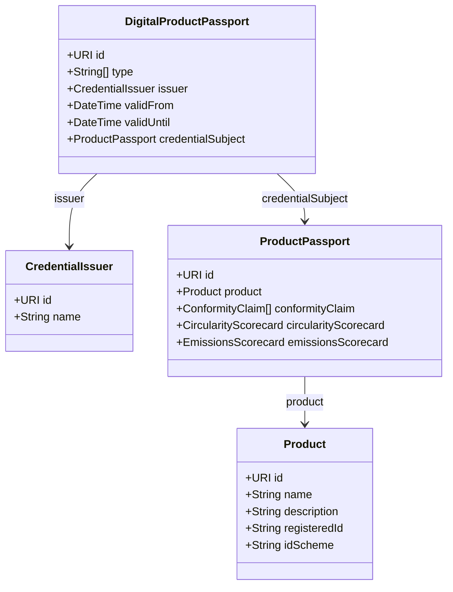

<!-- markdownlint-disable MD013 MD060 -->

# UNTP DPP Schema

The UN Trade Facilitation and Electronic Business Centre (UN/CEFACT) has developed the United Nations Transparency Protocol (UNTP) for Digital Product Passports.

## Overview

The UNTP Digital Product Passport (DPP) is a standardized format for sharing product sustainability and circularity information across supply chains.

## Schema Version

dppvalidator supports UNTP DPP Schema versions **0.6.0**, **0.6.1**
(default), and **0.7.0**. Both wire shapes are first-class and
coexist in the same release. See [UNTP DPP versions](untp-versions.md)
for the full version-handling story; this page describes the schema
itself.

The structure diagram below covers the **v0.6.x** shape — the wire
format used by the engine when no `$schema` or `@context` URL pins a
different version. The v0.7.0 shape is summarised at the end of this
page; the canonical v0.7.0 reference is the upstream DPP schema at
<https://untp.unece.org/artefacts/schema/v0.7.0/dpp/DigitalProductPassport.json>.

## Schema Structure



## Key Components

### DigitalProductPassport

The root credential containing:

- **id** — Unique identifier (URI)
- **type** — Credential types
- **issuer** — Who issued the passport
- **validFrom** / **validUntil** — Validity period
- **credentialSubject** — The actual passport data

### CredentialSubject (ProductPassport)

Contains product-specific information:

- **product** — Product details
- **conformityClaim** — Compliance declarations
- **cirularityScorecard** — Circularity metrics
- **emissionsScorecard** — Carbon footprint data
- **traceabilityInformation** — Supply chain data

### Product

Core product information:

- **id** — Product identifier
- **name** — Product name
- **description** — Product description
- **registeredId** — Official registration ID
- **idScheme** — ID scheme (GTIN, etc.)

## JSON Schema

Bundled SHA-pinned copies live under
[`src/dppvalidator/schemas/data/`](https://github.com/artiso-ai/dppvalidator/blob/main/src/dppvalidator/schemas/data/README.md);
the upstream production URLs are:

| Version | Production URL                                                                   |
| ------- | -------------------------------------------------------------------------------- |
| 0.6.1   | <https://test.uncefact.org/vocabulary/untp/dpp/untp-dpp-schema-0.6.1.json>       |
| 0.7.0   | <https://untp.unece.org/artefacts/schema/v0.7.0/dpp/DigitalProductPassport.json> |

## v0.6.x example

```json
{
  "@context": [
    "https://www.w3.org/ns/credentials/v2",
    "https://test.uncefact.org/vocabulary/untp/dpp/0.6.1/"
  ],
  "type": ["DigitalProductPassport", "VerifiableCredential"],
  "id": "https://example.com/dpp/battery-001",
  "issuer": {
    "id": "https://example.com/manufacturer",
    "name": "Battery Manufacturer Inc."
  },
  "validFrom": "2024-01-01T00:00:00Z",
  "validUntil": "2029-01-01T00:00:00Z",
  "credentialSubject": {
    "id": "https://example.com/product/battery-001",
    "type": ["ProductPassport"],
    "product": {
      "id": "https://example.com/product/battery-001",
      "name": "EV Battery Pack",
      "description": "High-capacity lithium-ion battery"
    }
  }
}
```

## v0.7.0 example

The structural shift in v0.7.0: `credentialSubject` IS the
`Product` directly, the `ProductPassport` envelope is gone, and the
top-level `name` field is required. Full v0.7.0-required Product
fields: `id`, `name`, `idScheme`, `idGranularity`, `productCategory`,
`producedAtFacility`, `countryOfProduction`.

```json
{
  "@context": [
    "https://www.w3.org/ns/credentials/v2",
    "https://vocabulary.uncefact.org/untp/0.7.0/context/"
  ],
  "type": ["DigitalProductPassport", "VerifiableCredential"],
  "id": "https://example.com/dpp/battery-001",
  "name": "EV Battery Pack DPP",
  "issuer": {
    "type": ["CredentialIssuer"],
    "id": "did:web:example.com:manufacturer",
    "name": "Battery Manufacturer Inc."
  },
  "validFrom": "2024-01-01T00:00:00Z",
  "validUntil": "2029-01-01T00:00:00Z",
  "credentialSubject": {
    "type": ["Product"],
    "id": "https://example.com/product/battery-001",
    "name": "EV Battery Pack",
    "description": "High-capacity lithium-ion battery",
    "idScheme": {
      "type": ["IdentifierScheme"],
      "id": "https://example.com/schemes/internal",
      "name": "Manufacturer internal scheme"
    },
    "idGranularity": "model",
    "productCategory": [
      {
        "type": ["Classification"],
        "schemeId": "https://unstats.un.org/unsd/classifications/Econ/cpc/",
        "schemeName": "UN Central Product Classification",
        "code": "46410",
        "name": "Primary cells and primary batteries"
      }
    ],
    "producedAtFacility": {
      "type": ["Facility"],
      "id": "https://example.com/facilities/001",
      "name": "Manufacturer facility"
    },
    "countryOfProduction": {
      "countryCode": "DE",
      "countryName": "Germany"
    }
  }
}
```

For a full field-by-field migration table from v0.6.x, see the
[migration guide](../guides/migration-0-6-to-0-7.md).

## Related Standards

- **W3C Verifiable Credentials** — Credential format
- **EU ESPR** — Ecodesign for Sustainable Products Regulation
- **CIRPASS** — Circular Economy Product Passport standards

## Next Steps

- [Three-Layer Validation](validation-layers.md) — How dppvalidator validates DPPs
- [Validation Guide](../guides/validation.md) — Using the validation engine
