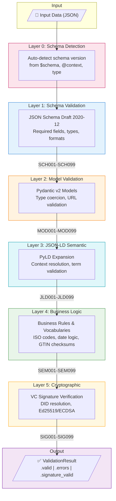

# Seven-Layer Validation

dppvalidator uses a seven-layer validation architecture to ensure Digital Product Passports are structurally correct, type-safe, semantically meaningful, cryptographically verifiable, and supply-chain traceable.

## Architecture



## Layer 0: Schema Detection

Automatically detects the DPP schema version from the input document.

**Detection priority:**

1. `$schema` URL pattern (e.g., `untp-dpp-schema-0.6.1.json` or
   `…/v0.7.0/.../DigitalProductPassport.json`)
1. `@context` URLs:
   - Legacy (0.6.x): `https://test.uncefact.org/vocabulary/untp/dpp/X.Y.Z/`
   - Modern (0.7.0+): `https://vocabulary.uncefact.org/untp/X.Y.Z/context/`
1. `type` array presence → default version
1. Fallback to `dppvalidator.schemas.registry.DEFAULT_SCHEMA_VERSION`
   (currently `0.6.1`)

```python
from dppvalidator import ValidationEngine

# Auto-detection (default)
engine = ValidationEngine()

# Pin v0.6.1 explicitly. A v0.7.0 payload through this engine fails
# fast with VER001 (version mismatch).
engine = ValidationEngine(schema_version="0.6.1")

# Pin v0.7.0 explicitly.
engine = ValidationEngine(schema_version="0.7.0")
```

The full version-handling story (detection internals, default-version
constant, adding a new UNTP version) lives in
[UNTP DPP versions](untp-versions.md).

### Per-version layer dispatch

Layers 1–3 below dispatch through version-keyed tables — the engine
selects the right model / rule set / link paths for the detected
version. The dispatch is centralised in three tables:

<!-- markdownlint-disable MD013 MD060 -->

| Table                   | Module                                                                                                                              | Layer it powers                           |
| ----------------------- | ----------------------------------------------------------------------------------------------------------------------------------- | ----------------------------------------- |
| `_MODEL_BY_VERSION`     | [`validators/model.py`](https://github.com/artiso-ai/dppvalidator/blob/main/src/dppvalidator/validators/model.py)                   | Model layer (Layer 2)                     |
| `ALL_RULES_BY_VERSION`  | [`validators/rules/__init__.py`](https://github.com/artiso-ai/dppvalidator/blob/main/src/dppvalidator/validators/rules/__init__.py) | Semantic layer (Layer 4)                  |
| `LINK_PATHS_BY_VERSION` | [`validators/deep.py`](https://github.com/artiso-ai/dppvalidator/blob/main/src/dppvalidator/validators/deep.py)                     | Deep validator (separate from layers 1–5) |

<!-- markdownlint-enable MD013 MD060 -->

Plugin authors can opt into version-aware dispatch by setting
`applies_to_versions = ("0.7.0",)` on their rule class — see the
[plugin development guide](../guides/plugins.md#writing-a-version-aware-rule).

## Layer 1: Schema Validation

Validates JSON structure against the UNTP DPP JSON Schema.

**What it checks:**

- Required fields are present
- Field types match schema (string, number, array, etc.)
- String formats (URI, date-time, email)
- Enum values
- Array constraints (minItems, maxItems)
- Object constraints (additionalProperties)

**Error codes:** `SCH001` - `SCH099`

## Layer 2: Model Validation

Validates data against Pydantic models with stricter type checking.

**What it checks:**

- Python type constraints
- URL validation (HttpUrl)
- Date/datetime parsing
- Custom field validators
- Model-level validators (cross-field)

**Error codes:** `MOD001` - `MOD099`

## Layer 3: JSON-LD Semantic Validation

Validates JSON-LD semantics using PyLD expansion algorithm.

**What it checks:**

- `@context` is present and valid
- All terms resolve during expansion (no undefined terms)
- Custom terms use proper namespacing
- Context URLs are reachable

**Error codes:** `JLD001` - `JLD099`

```python
from dppvalidator import ValidationEngine

# Enable JSON-LD validation
engine = ValidationEngine(validate_jsonld=True)

# Or via layers
engine = ValidationEngine(layers=["schema", "model", "jsonld"])
```

## Layer 4: Business Logic Validation

Validates business rules and external vocabulary references.

**What it checks:**

- Vocabulary values (ISO country codes, UN/CEFACT unit codes)
- Material codes (UNECE Rec 46)
- HS codes for product classification
- GTIN checksums (GS1 standard)
- Date relationships (validFrom < validUntil)
- Cross-reference consistency

**Error codes:** `SEM001` - `SEM099`, `VOC001` - `VOC099`

## Layer 5: Cryptographic Verification

Verifies Verifiable Credential signatures and DID resolution.

**What it checks:**

- DID resolution (`did:web`, `did:key`)
- Signature verification (Ed25519, ES256, ES384)
- Proof types (Ed25519Signature2020, DataIntegrityProof, JsonWebSignature2020)

**Error codes:** `SIG001` - `SIG099`

```python
from dppvalidator import ValidationEngine

# Enable signature verification
engine = ValidationEngine(verify_signatures=True)
result = engine.validate(dpp_data)

# Check verification status
if result.signature_valid:
    print(f"Signed by: {result.issuer_did}")
```

## Deep Validation

For supply chain traceability, use async deep validation to crawl linked documents.

```python
from dppvalidator import ValidationEngine

engine = ValidationEngine()

# Validate with supply chain traversal
result = await engine.validate_deep(
    dpp_data,
    max_depth=3,
    follow_links=["credentialSubject.traceabilityEvents"],
    timeout=30.0,
)

print(f"Total documents: {result.total_documents}")
print(f"All valid: {result.valid}")
```

## Selecting Layers

```python
from dppvalidator import ValidationEngine

# All layers (default)
engine = ValidationEngine()

# Schema only
engine = ValidationEngine(layers=["schema"])

# Model + Semantic (skip schema)
engine = ValidationEngine(layers=["model", "semantic"])

# Full validation with JSON-LD and signatures
engine = ValidationEngine(
    validate_jsonld=True,
    verify_signatures=True,
)
```

## Performance

Benchmark results (1000 iterations, Apple Silicon):

| Layer            | Mean Time | Throughput        |
| ---------------- | --------- | ----------------- |
| Model (minimal)  | 0.012ms   | 84,387 ops/sec    |
| Model (full)     | 0.016ms   | 63,945 ops/sec    |
| Semantic         | 0.005ms   | 200,889 ops/sec   |
| Full (Model+Sem) | 0.022ms   | 45,735 ops/sec    |
| Engine Creation  | 0.001ms   | 1,524,868 ops/sec |

Run benchmarks: `uv run python -m benchmarks.run_benchmarks --all`

*JSON-LD and signature verification depend on network latency (cached after first request).*

## Next Steps

- [Validation Guide](../guides/validation.md) — Using the validation engine
- [API Reference](../reference/api/validators.md) — ValidationEngine API
